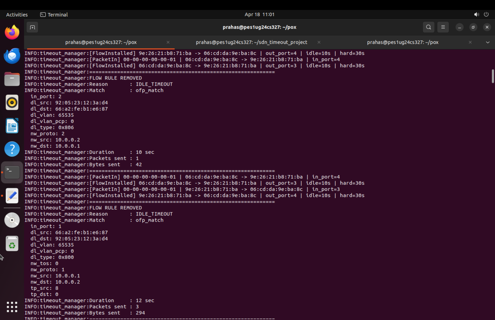
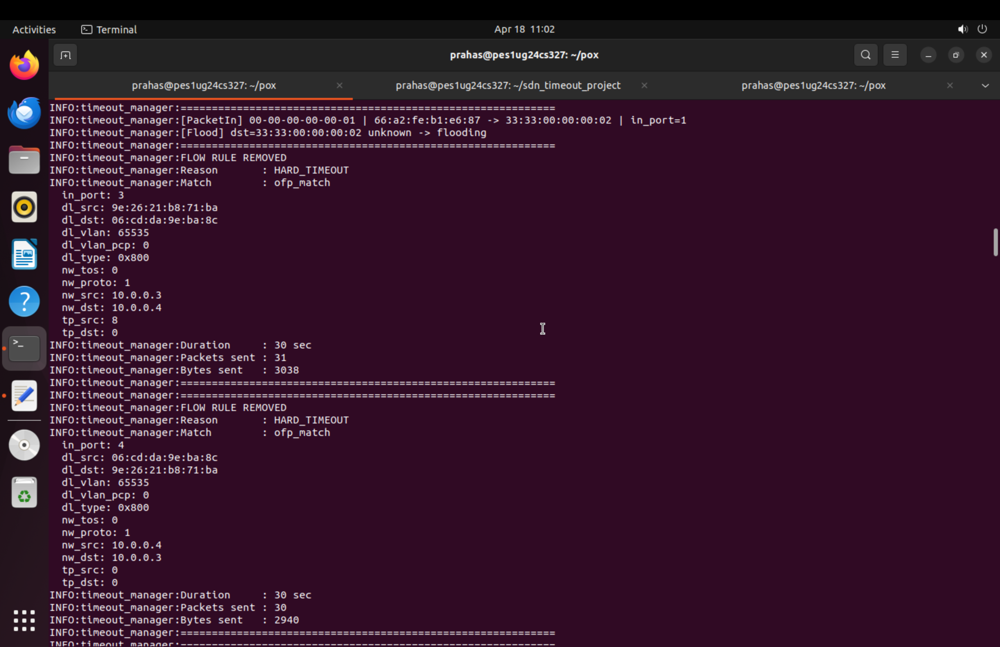

# SDN Flow Rule Timeout Manager using POX + Mininet

## 📌 Problem Statement

This project implements a Software Defined Networking (SDN) solution using **Mininet** and a **POX controller** to demonstrate the lifecycle of flow rules in an OpenFlow network.

The objective is to:

* Understand controller–switch interaction
* Implement match–action flow rules
* Demonstrate **idle timeout** and **hard timeout**
* Observe dynamic flow behavior in a network

---

## 🎯 Objective

* Build a Mininet topology with hosts and switches
* Implement a POX controller acting as a **learning switch**
* Install flow rules dynamically based on traffic
* Demonstrate:

  * Flow installation
  * Flow expiration (idle & hard timeout)
* Analyze network behavior using logs and flow tables

---

## 🛠️ Technologies Used

* Python
* Mininet
* POX Controller
* OpenFlow (v1.0)
* Ubuntu (VMware environment)

---

## 🧱 Project Structure

```
sdn_timeout_project/
├── timeout_manager.py        # POX Controller logic
├── topology.py               # Mininet topology
├── screenshots/              # Output screenshots
└── README.md
```

---

## ⚙️ Setup Instructions

### 1. Start POX Controller

```bash
cd ~/pox
python3 pox.py log.level --DEBUG openflow.of_01 timeout_manager
```

---

### 2. Start Mininet Topology (new terminal)

```bash
cd ~/sdn_timeout_project
sudo python3 topology.py
```

---

### 3. Mininet CLI will open

You can now run commands like:

```bash
h1 ping -c 3 h2
```

---

## 🔄 Controller Logic (Working Explanation)

The controller performs the following:

1. **PacketIn Handling**

   * Learns MAC → port mapping
   * Logs incoming packets

2. **Flow Installation**

   * Installs flow rules with:

     * `idle_timeout = 10 seconds`
     * `hard_timeout = 30 seconds`
   * Uses match–action logic

3. **Flow Removal Handling**

   * Logs when a flow expires
   * Displays:

     * Reason (Idle / Hard Timeout)
     * Duration
     * Packet count
     * Byte count

---

## 🧪 Test Scenarios

### ✅ Scenario 1: Idle Timeout

```bash
h1 ping -c 3 h2
```

Then:

* Wait **10–15 seconds (no traffic)**

Expected Output:

```
*** FLOW RULE EXPIRED ***
Reason : IDLE_TIMEOUT
Duration : ~10 seconds
```

---

### ✅ Scenario 2: Hard Timeout

```bash
h1 ping h2
```

* Continuous traffic
* Wait ~30 seconds

Expected Output:

```
*** FLOW RULE EXPIRED ***
Reason : HARD_TIMEOUT
Duration : ~30 seconds
```

---

## 📊 Flow Table Observation

Run in a separate terminal:

```bash
sudo ovs-ofctl dump-flows s1
```

* Shows installed flow rules
* After timeout → rules disappear

---

## 📈 Performance Observation

### Latency (Ping)

* Measured using:

```bash
h1 ping -c 3 h2
```

* Observed low latency (~1–10 ms)

---

### Throughput (iperf)

```bash
iperf h1 h2
```

* Used to analyze bandwidth between hosts
* Confirms network connectivity and performance

---

## 🔍 Key Observations

* Flow rules are dynamically installed on first packet
* Idle timeout removes inactive flows
* Hard timeout removes flows regardless of traffic
* Flow lifecycle:

```
PacketIn → FlowInstalled → Traffic → FlowRemoved
```

---

## 📸 Output Screenshots

(Add your images inside `screenshots/` folder)

### Flow Installation


### Idle Timeout



### Hard Timeout



### Flow Table


---

## ✅ Functional Validation

* Controller correctly handles PacketIn events
* Flow rules installed with correct match–action
* Idle and Hard timeout verified
* Logs confirm rule lifecycle
* Consistent behavior across runs (regression tested)

---

## 📚 References

* POX Controller Documentation
* Mininet Documentation
* OpenFlow Specification

---

## 🏁 Conclusion

This project successfully demonstrates:

* SDN controller-driven networking
* Flow rule lifecycle management
* Timeout-based rule removal
* Real-time network behavior observation

It provides a clear understanding of how SDN dynamically controls network flows using OpenFlow.

---

## 👤 Author

Prahas
